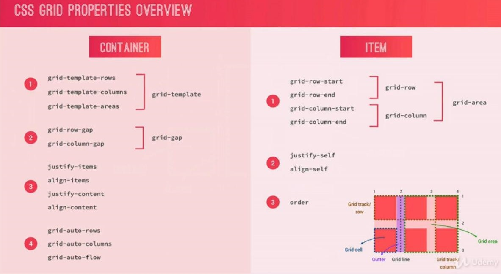

## Live Demo
Here you could find the result set of Udemy Advanced CSS and SASS Courses (Third Project, Nexter)  
And also here you could find a lot of simple examples which was made in codepen.  
**You can find a demo via the next url**: [Link](https://glareone.github.io/Advanced-CSSGrid-Nexter-FrontEnd-Portfolio-Project)

**CssGrid properties**:  

## CodePen Demos according lecture exercises.

### Lecture 1:
* Basics: [Link](https://codepen.io/Glareone/pen/bXBzMx)

### Lecture 2, ordering:
* stage 1: [Link](https://codepen.io/Glareone/pen/PMbvye)
* stage 2: [Link](https://codepen.io/Glareone/pen/bXByPz)

### Lecture 3, spanning items (number of column\row, span, -1):
* stage 1: [Link](https://codepen.io/Glareone/pen/eqBwNJ)
* stage 2: [Link](https://codepen.io/Glareone/pen/QeGXye)
* stage 3: [Link](https://codepen.io/Glareone/pen/zgoVKN)

### Lecture 4, Grid Challenge:
* Method 1, Line numbers: [Link](https://codepen.io/Glareone/pen/QeGXrj)
* Method 2, Line naming: [Link](https://codepen.io/Glareone/pen/qeRBjV)
* Method 3, Naming Grid Areas:  [Link](https://codepen.io/Glareone/pen/rXjNrm). And with some experiments [Link](https://codepen.io/Glareone/pen/bXgGZd)

### Lecture 5, Implicit vs Explicit Grids:
* [Link](https://codepen.io/Glareone/pen/wVgBvK)

### Lecture 6, Align Grid Items:
* [Link](https://codepen.io/Glareone/pen/gVgbmp)

### Lecture 7, Align Tracks (Grid in container):
*  Stage 1 [Link](https://codepen.io/Glareone/pen/MNJYqG)
* Stage 2, grid-auto-flow: row dense; [Link](https://codepen.io/Glareone/pen/ZgLYZq)  
(to change grid order algorithm and occupy some free space, "NO HOLES")

### Lecture 8, min-content, max-content:
* Stage 1, min-content and max-content example: [Link](https://codepen.io/Glareone/pen/QedbaZ)
* Stage 2, minmax function with rows: [Link](https://codepen.io/Glareone/pen/BXpNqP)
* Stage 3, minmax function also with columns: [Link](https://codepen.io/Glareone/pen/Xvpbyb)

### Lecture 9, auto-fit, auto-fill:
* Stage 1, auto-fit and auto-fill: [Link](https://codepen.io/Glareone/pen/EqZjqy?editors=1100)
* Stage 2, replacing elements if all tracks can't be placed in one row: [Link](https://codepen.io/Glareone/pen/MNJaww)

## Project itself. Configurations. Running
1. npm install
2. npm start

To build the production version of this site you have to use the next script:
1. npm run build:css

Also there are several scripts which are used by "build:css" and "start":
1. "watch:sass" - watch changes in sass files and update their css result file. Used for development purposes
2. "compile:sass": - creates a sass compile file. Used as a start point of build process.
3. "prefix:css": - uses autoprefixer to support different browsers. It works with compiled file from the beginning.
4. "compress:css": - compressing the result file and compilation and prefixing
